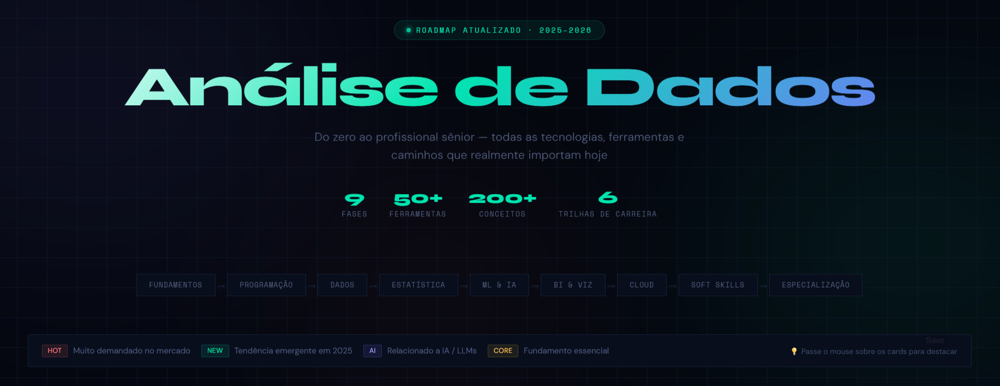

# ✨ Data Analytics Roadmap

Roadmap interativo criado para organizar estudos em Análise de Dados de forma visual, estratégica e intuitiva.

---

## 📷 Preview

---

## 🚀 Funcionalidades

- Roadmap visual de estudos
- Organização por etapas
- Interface intuitiva
- Estrutura interativa
- Design responsivo

---

## 🛠 Tecnologias utilizadas

- HTML
- CSS
- JavaScript

---

## 📌 Objetivo

Centralizar conteúdos e tornar a jornada de aprendizado mais clara, organizada e motivadora.

---

## 🌐 Status

Projeto em desenvolvimento contínuo.